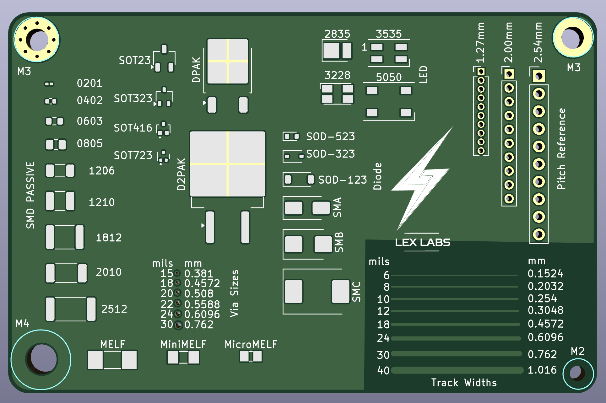
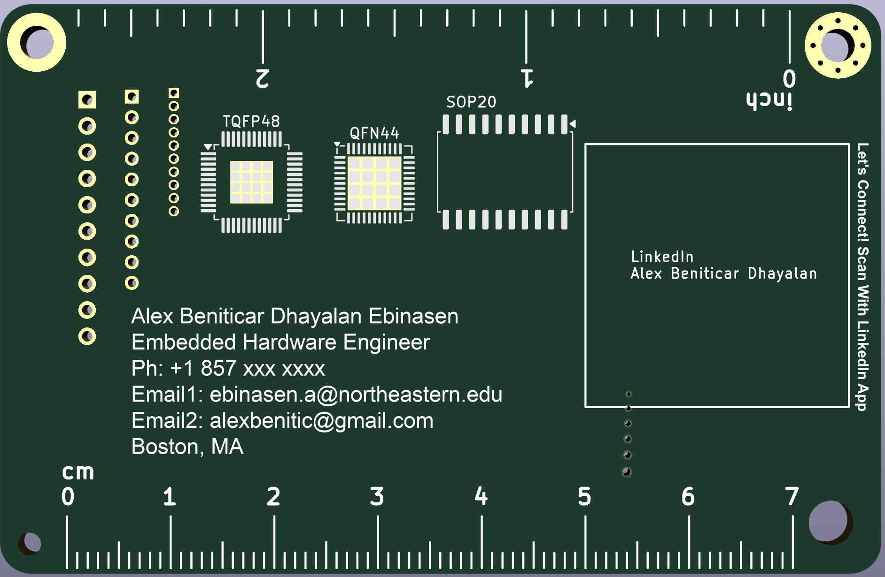
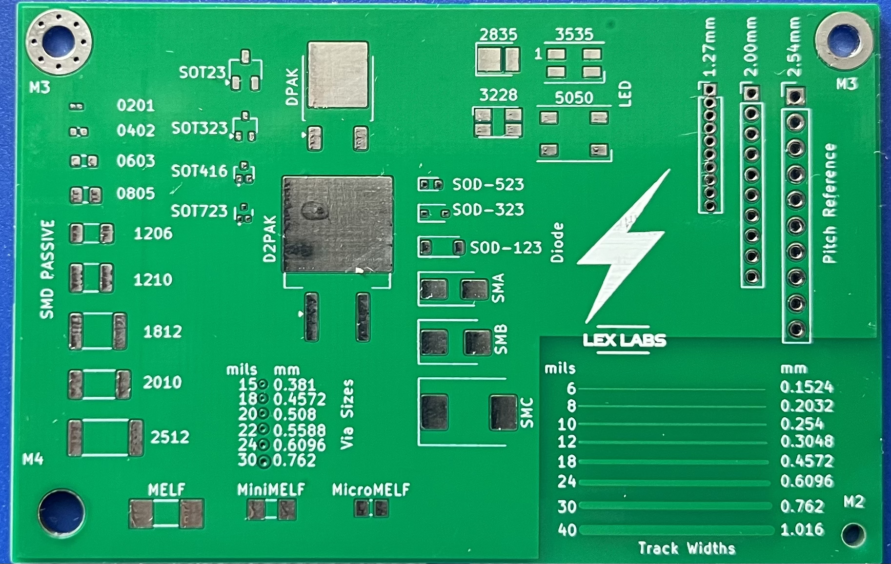
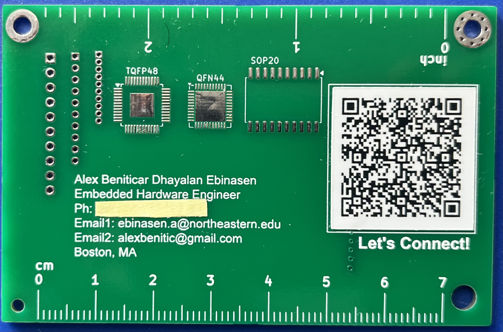

# Create Your Own PCB Business Card with KiCad

## Designing Your PCB Business Card
1. **Download KiCad**
   - Install KiCad 8.0 from the [KiCad website](https://www.kicad.org/download/).

2. **Open PCB Editor**
   - open the `Business card PCB.kicad_pro` file

3. **Edit Layers**
   - Customize the front and back layers with your contact information, logo, and any other designs.

## Exporting Gerber Files
1. **Generate Gerber Files**
   - Navigate to `File` -> `Fabrication Outputs` -> `Gerbers` to export your design files.

2. **Configure Gerber Settings**
   - Follow your PCB manufacturer's recommendations for Gerber settings. For example, [JLCPCB's guide](https://jlcpcb.com/help/article/362-how-to-generate-gerber-and-drill-files-in-kicad-7) provides detailed instructions.

## Ordering Your PCB Business Cards
1. **Select a Manufacturer**
   - Choose a manufacturer that suits your needs and budget, and upload your Gerber files.
     
2. **Choosing Thickness**
   - Choose the right thickness you'd want, the regular 1.6mm or the thinner 0.8mm (0.8mm fits best in the wallet).
   
4. **Manufacturing Process**
   - Specify materials, finishes, and other custom options. Review the final product to ensure quality.

## Images of the Business Card

*Kicad Render Front V1*

*Kicad Render Back V1*

*Actual Manufactured PCB Front V1*

*Actual Manufactured PCB Back V1*

## Licensing

<a property="dct:title" rel="cc:attributionURL" href="https://github.com/AlexDhayalan/NameCard_PCB">Name Card PCB</a> by <a rel="cc:attributionURL dct:creator" property="cc:attributionName" href="https://www.linkedin.com/in/alex-beniticar-dhayalan-8220444a/">Alex Beniticar Dhayalan</a> is marked with <a href="https://creativecommons.org/publicdomain/zero/1.0/?ref=chooser-v1" target="_blank" rel="license noopener noreferrer" style="display:inline-block;">CC0 1.0</a>

